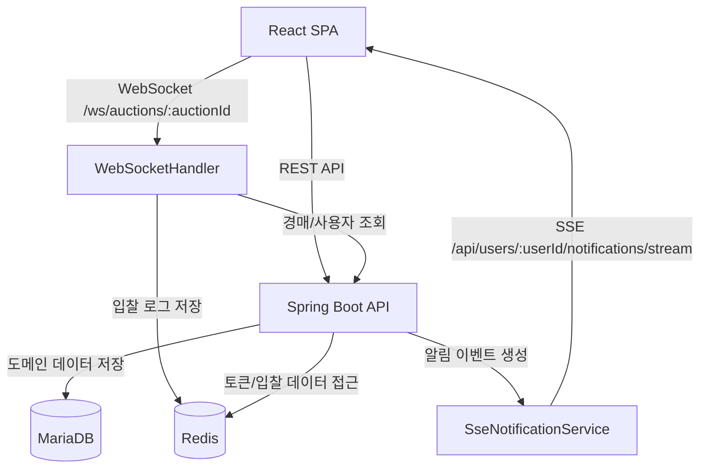

# 🔨 실시간 경매 시스템 (README v3)

## 📖 프로젝트 개요

실시간 입찰(WebSocket)과 사용자 알림(SSE)을 중심으로 구현된 온라인 경매 플랫폼입니다.  
현재 문서는 **코드 기준 As-Is 분석 결과**를 반영해 작성했습니다.

- 문서 기준일: 2026-03-02
- 기준 브랜치: 로컬 현재 워크스페이스

## ⏰ 개발 기간

- 2024-09-11 ~ 2024-12-11

## 🗂 모노레포 구조

```text
backend             - Spring Boot API, WebSocket, SSE, JPA/Redis, 스케줄러
frontend            - React SPA, Redux, Axios
monitoring          - Prometheus / Grafana 로컬 모니터링
k6-test             - 부하 테스트 스크립트
server-health-check - 서버 상태 체크 및 보조 기록 유틸
assets              - ERD/플로우차트/스크린샷
docs                - 상세 명세/분석 문서
```

## ⚙ 기술 스택

### Frontend

- React 18
- Redux Toolkit
- React Router v6
- Axios
- TailwindCSS + SCSS
- Chart.js / react-chartjs-2

### Backend

- Java 17
- Spring Boot 3.3.x
- Spring Security + JWT
- Spring Data JPA (MariaDB)
- Spring Data Redis (Lettuce)
- Spring WebSocket / SSE
- Spring Actuator + Prometheus

### Infra / Tools

- MariaDB
- Redis
- Prometheus
- Grafana
- k6
- Node.js(server-health-check)

## 🏗 아키텍처 요약



## 🔍 핵심 기능

### 1) 실시간 입찰

- WebSocket 엔드포인트: `ws://localhost:8080/ws/auctions/{auctionId}`
- 메시지 타입:
  - 수신: `bid`, `buy-now`
  - 송신: `bid`, `buy-now`, `ended`, `time`, `error`, `token_expired`
- 입찰 검증:
  - 판매자 본인 입찰 금지
  - 시작가/현재가 초과 조건 검증
  - 현재 최고입찰자 재입찰 금지

### 2) 알림 시스템

- 사용자별 SSE 엔드포인트: `GET /api/users/{userId}/notifications/stream`
- 이벤트 타입:
  - `connect` (초기 알림 스냅샷)
  - `notification` (신규 알림)
  - `ping` (keepalive)
- 알림 타입(백엔드 enum):
  - `BID`, `OUTBID`, `WIN`, `REMINDER`, `ENDED`, `ENDED_TIME`, `BUY_NOW_WIN`

### 3) 경매 종료 처리

- 스케줄러(`AuctionService.updateEndedAuctions`)가 30초 주기로 종료 경매 정산
- 즉시구매 종료 시:
  - 구매자: `WIN`
  - 기존 입찰자: `ENDED`
- 시간 만료 종료 시:
  - 최고입찰자: `WIN`
  - 비낙찰자: `ENDED_TIME`
- WebSocket `ended` 브로드캐스트 전송

### 4) 인증/인가

- 로그인 시 Access/Refresh JWT 발급
- Refresh Token은 Redis(`Auth`)에 TTL과 함께 저장
- 프론트 Axios interceptor로 `401 -> /api/auth/refresh` 재시도

## 🌐 API 요약

### Auth

- `POST /api/auth/login`
- `POST /api/auth/signup`
- `GET /api/auth/logout`
- `GET /api/auth/refresh`

### Auction

- `GET /api/auctions`
- `GET /api/auctions/featured`
- `GET /api/auctions/{auctionId}`
- `POST /api/auctions`
- `POST /api/auctions/{auctionId}/buy-now`
- `POST /api/auctions/{auctionId}/favorites`

### User / Notification

- `GET /api/users`
- `GET /api/users/notifications`
- `GET /api/users/{userId}/notifications/stream` (SSE)
- `PATCH /api/users/notifications/all`
- `PATCH /api/users/notifications`
- `DELETE /api/users/notifications/all`
- `DELETE /api/users/notifications`

### Migration

- `GET /api/migration/bids?target=redis|mariadb`

## 🔄 하이브리드 저장 전략

- MariaDB:
  - 경매/사용자/카테고리/알림/거래/관심 등 정합성 중심 데이터
- Redis:
  - 실시간 입찰 로그(`RedisBid`)
  - Refresh Token(`Auth`)
- 동기화:
  - `BidMigrationService`로 Redis ↔ MariaDB 수동 마이그레이션 API 제공

## 🧭 프론트 동작 요약

- 라우팅:
  - 공개: 홈, 목록, 상세, 로그인, 회원가입, 문의/지원
  - 보호: `/user/profile`, `/auctions/new`
- 상세 페이지:
  - 초기 상세 조회 + WebSocket 연결
  - 입찰/즉시구매 요청 송신
  - 실시간 가격/남은시간/거래결과 반영
- 알림 드롭다운:
  - SSE connect 시 초기 목록 수신
  - notification 이벤트 수신 시 중복 갱신
  - 읽음/삭제 API 처리

## 🛠 실행 가이드

## 1) 사전 준비

- JDK 17
- Node.js / npm
- MariaDB (`auction_db`)
- Redis (`localhost:6379`)

## 2) Backend 실행

```bash
cd backend
./gradlew bootRun      # macOS/Linux
.\gradlew.bat bootRun  # Windows
```

- 기본 주소: `http://localhost:8080`

## 3) Frontend 실행

```bash
cd frontend
npm install
npm start
```

- 개발 서버: `http://localhost:80` (`craco.config.js` 기준)

## 4) Monitoring 실행(선택)

```bash
cd monitoring
docker compose -f monitoring-docker-compose.yml up -d
```

- Prometheus: `http://localhost:9090`
- Grafana: `http://localhost:5000`

## 5) Health Check 실행(선택)

```bash
cd server-health-check
npm install
npm start
```

## 📊 운영/모니터링

- Actuator 노출: `health`, `prometheus`
- Prometheus 스크랩: `host.docker.internal:8080/actuator/prometheus` (5초)
- 서버 상태 체크 유틸:
  - 3초 주기 health 폴링
  - 상태 변화를 `server_status.log`로 기록
  - 비정상 종료 추정 시 `server_lifecycle` 보조 기록

## 🧪 테스트 현황

### Backend

- `AuctionApplicationTests` (context load)
- `AuctionServiceNotificationTest` (종료 알림 분기)
- `WebSocketHandlerConcurrencyCurrentBehaviorTest`
- `WebSocketHandlerConcurrencyExpectedBehaviorTest`
- `WebSocketHandlerConcurrencyTestSupport`

### Frontend

- 저장소 기준 사용자 정의 테스트 파일 확인되지 않음

## ⚠ As-Is 이슈/갭

1. 보안 설정

- `SecurityConfig`에서 `requestMatchers("/**").permitAll()` 적용
- HTTP 레벨 인증 강제가 사실상 비활성화됨

2. 프론트 레거시 API 잔재

- `frontend/src/apis/AuctionAPI.js`에 `POST /api/auctions/{id}/bids` 호출 함수가 남아있음
- 현재 입찰은 WebSocket 기반이며 해당 REST 엔드포인트는 백엔드 미구현

3. k6 스크립트 경로 불일치

- `k6-test/websocketTest.js`는 `/api/auctions/{id}/ws` 사용
- 실제 WebSocket 경로는 `/ws/auctions/{auctionId}`
- `simpleSseTest.js`도 현재 SSE 경로와 불일치

4. 레거시 SSE 코드 공존

- `SseService`에 경매 단위 SSE 코드가 남아있고 일부 메서드는 사용 중지 주석 처리
- 실제 사용자 알림은 `SseNotificationService` 중심으로 동작

5. 동시성 제어 한계

- WebSocket 입찰 경로는 애플리케이션 레벨 검증은 있으나
- 원자적 경쟁 제어(예: 분산락/CAS 기반 업데이트)까지는 구현되지 않음
- 관련 취약점 재현/기대동작 테스트 코드가 분리되어 존재

6. 알림 타입 사용 불균형

- `BUY_NOW_WIN` 타입은 enum/프론트 처리 분기에는 있으나 현재 생성 경로가 뚜렷하지 않음

## 🔐 보안 주의사항

- 현재 `application.properties`에 개발용 민감정보(DB 계정/JWT secret)가 포함되어 있습니다.
- 운영 환경에서는 반드시 아래로 분리하세요.
  - 환경변수/시크릿 매니저 사용
  - 설정 파일 커밋 금지
  - 프로파일 분리(`dev`, `prod`)

## 📎 참고 자산

- ERD: `assets/er-diagram.png`
- 경매 플로우차트: `assets/auction-flowchart.png`
- 상세 분석 문서: `docs/project-spec.md`
- 동시성/원자성 정리: `docs/bid-atomicity-control.md`
