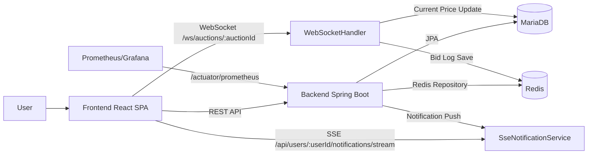
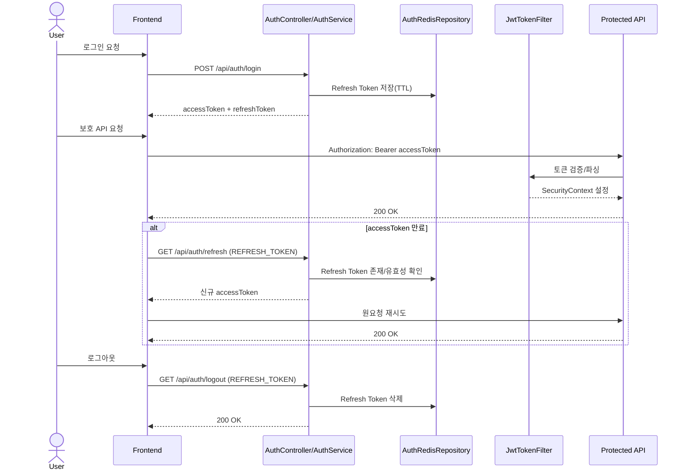
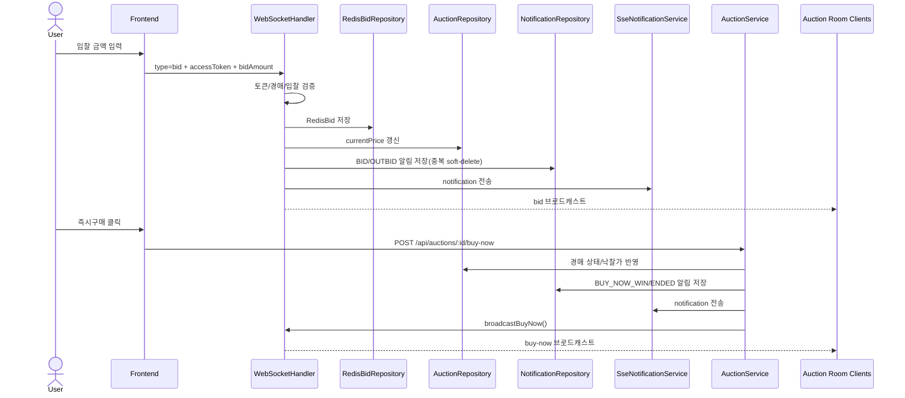
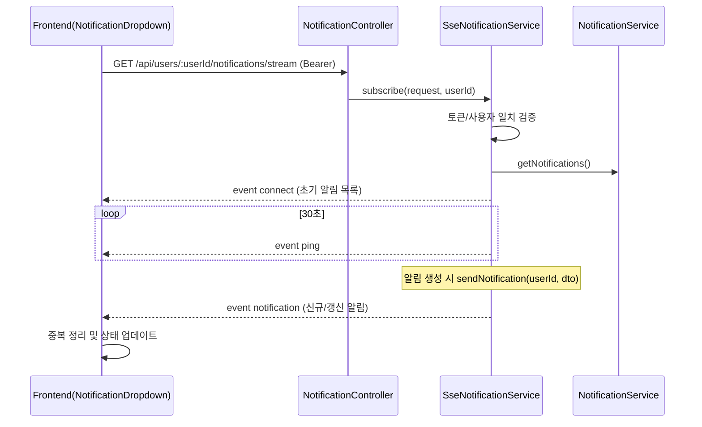

# realtime-auction-spring 프로젝트 명세서

- 문서 성격: As-Is 구현 명세 + 갭 분석
- 문서 버전: 1.0
- 작성일: 2026-02-24
- 기준: 로컬 코드베이스(`backend`, `frontend`, `monitoring`, `k6-test`, `server-health-check`)

## 1. 문서 목적/범위

### 1.1 목적

- 현재 코드 구현을 기준으로 시스템 동작을 명확히 문서화한다.
- 백엔드/프론트엔드/실시간 통신/운영 구성을 단일 문서에서 파악 가능하도록 정리한다.
- 구현-계약 불일치 영역을 `As-Is 갭 분석`으로 명시한다.

### 1.2 범위

- 백엔드(Spring Boot) 도메인/API/실시간 처리/스케줄러/예외 규약
- 프론트엔드(React) 라우팅/상태관리/API 클라이언트/페이지 시나리오
- 운영 구성(Prometheus/Grafana, health check, k6 스크립트)
- 테스트 현황과 품질 리스크

### 1.3 비범위

- 코드 리팩터링/버그 수정/기능 추가
- 데이터 마이그레이션 실제 수행
- 배포 자동화(CI/CD) 구축

### 1.4 소스 오브 트루스

- 코드가 단일 진실원천(SoT)이다.
- 루트 `README.md`는 한글 인코딩 깨짐이 있어 서술형 설명은 코드 분석 결과를 우선한다.

## 2. 시스템 개요 및 기술 스택

### 2.1 모노레포 구조

| 경로                  | 역할                                                 |
| --------------------- | ---------------------------------------------------- |
| `backend`             | Spring Boot API, WebSocket, SSE, JPA/Redis, 스케줄러 |
| `frontend`            | React SPA, Redux 상태관리, Axios API 클라이언트      |
| `monitoring`          | Prometheus/Grafana 로컬 모니터링 구성                |
| `k6-test`             | 성능/부하 테스트 스크립트                            |
| `server-health-check` | 서버 헬스 모니터링 및 DB 상태 기록 유틸              |
| `assets`              | ERD/플로우차트/스크린샷                              |

### 2.2 핵심 기술 스택

| 구분             | 기술                                                                   |
| ---------------- | ---------------------------------------------------------------------- |
| 백엔드 런타임    | Java 17, Spring Boot 3.3.4                                             |
| 백엔드 주요 모듈 | Spring Web, Data JPA, Security, Validation, WebSocket, Redis, Actuator |
| 인증             | JWT(`jjwt` 0.12.3), Refresh Token Redis 저장                           |
| DB/캐시          | MariaDB, Redis(Lettuce, Spring Data Redis)                             |
| 프론트엔드       | React 18, Redux Toolkit, React Router v6, Axios                        |
| UI               | TailwindCSS, SCSS, Chart.js, lucide-react                              |
| 모니터링         | Prometheus, Grafana, Spring Actuator Prometheus endpoint               |
| 부하 테스트      | k6(JavaScript)                                                         |

### 2.3 런타임 포트/호스트

| 컴포넌트            | 기본 주소/포트                                | 근거                                                |
| ------------------- | --------------------------------------------- | --------------------------------------------------- |
| Backend API         | `http://localhost:8080`                       | `backend/src/main/resources/application.properties` |
| Frontend Dev Server | `http://localhost:80`                         | `frontend/craco.config.js`                          |
| WebSocket           | `ws://localhost:8080/ws/auctions/{auctionId}` | `backend/global/config/WebSocketConfig.java`        |
| 이미지 정적 경로    | `http://localhost:8080/auction/images/*`      | `backend/global/config/WebConfig.java`              |
| Prometheus          | `http://localhost:9090`                       | `monitoring/monitoring-docker-compose.yml`          |
| Grafana             | `http://localhost:5000`                       | `monitoring/monitoring-docker-compose.yml`          |

### 2.4 실행 전제 조건 및 주요 환경값

| 항목          | 값(As-Is)                                  | 비고                        |
| ------------- | ------------------------------------------ | --------------------------- |
| DB URL        | `jdbc:mariadb://localhost:3306/auction_db` | 로컬 MariaDB 필요           |
| DB 계정       | `auction / 1234`                           | 운영 환경 분리 필요         |
| Redis         | `localhost:6379`                           | 로컬 Redis 필요             |
| Actuator 노출 | `health,prometheus`                        | `/actuator/prometheus` 수집 |
| 업로드 경로   | `src/main/resources/auction/upload/`       | 파일 시스템 쓰기 필요       |
| JWT 만료      | Access 1시간 / Refresh 1일                 | `application.properties`    |

보안 주의:

- 저장소 내 설정에 개발용 민감정보(예: JWT secret, DB 비밀번호)가 포함되어 있다.
- 본 문서에서는 민감값을 재인용하지 않으며, 환경 분리(ENV/Secret Manager)를 권장한다.

## 3. 아키텍처 및 런타임 구성

### 3.1 상위 아키텍처

- 프론트엔드가 REST API를 통해 조회/등록/인증 요청을 수행한다.
- 경매 입찰/즉시구매는 WebSocket(`/ws/auctions/{auctionId}`)으로 실시간 처리된다.
- 알림은 사용자별 SSE 스트림(`/api/users/{userId}/notifications/stream`)으로 전달된다.
- 관계형 데이터(사용자/경매/카테고리/거래/알림 등)는 MariaDB(JPA)에 저장된다.
- 입찰 로그는 Redis(`RedisBid`)에 저장되며, 별도 마이그레이션 API로 MariaDB와 동기화 가능하다.
- 스케줄러가 경매 종료 처리, 알림 ping, 종료 임박 알림을 주기 실행한다.



### 3.2 인증 처리 구조

- 로그인 시 Access/Refresh JWT를 발급한다.
- Refresh Token은 Redis(`AuthRedisRepository`)에 TTL과 함께 저장한다.
- HTTP 요청 시 `Authorization: Bearer <token>`을 파싱하여 `JwtTokenFilter`가 SecurityContext를 설정한다.
- Access Token 만료 시 프론트 `HttpClientManager`가 `/api/auth/refresh` 호출 후 재시도한다.
- 로그아웃 시 `REFRESH_TOKEN` 헤더 기반으로 Redis 토큰을 제거한다.

### 3.3 보안 구성 현황

- `SecurityConfig`에서 `requestMatchers("/**").permitAll()`이 적용되어 HTTP 레벨 강제 인증은 사실상 비활성이다.
- 실제 인증 요구는 서비스 계층 또는 컨트롤러 내부 로직에서 수동 검증하는 형태다.

## 4. 백엔드 명세

### 4.1 도메인 모듈 맵

| 모듈           | 책임                                           | 주요 클래스                                                               |
| -------------- | ---------------------------------------------- | ------------------------------------------------------------------------- |
| `auth`         | 로그인/회원가입/토큰 갱신/로그아웃             | `AuthController`, `AuthService`, `AuthRedisRepository`                    |
| `user`         | 사용자 조회, UserDetails 로딩                  | `UserController`, `UserService`, `CustomUserDetailsService`               |
| `auction`      | 경매 조회/생성/즉시구매/관심 등록, 종료 스케줄 | `AuctionController`, `AuctionService`, `AuctionRepository`                |
| `bid`          | WebSocket 실시간 입찰 처리, Redis 입찰 저장    | `WebSocketHandler`, `RedisBidRepository`                                  |
| `notification` | 알림 조회/읽음/삭제, 사용자별 SSE 알림         | `NotificationController`, `NotificationService`, `SseNotificationService` |
| `transaction`  | 낙찰 거래 기록 저장/조회                       | `Transaction`, `TransactionRepository`                                    |
| `category`     | 카테고리 조회                                  | `CategoryController`, `CategoryService`                                   |
| `favorite`     | 관심 경매 토글/카운트/조회                     | `FavoriteRepository`                                                      |
| `migration`    | Redis ↔ MariaDB 입찰 마이그레이션              | `BidMigrationController`, `BidMigrationService`                           |
| `lifecycle`    | 서버 시작/종료 기록, 다운타임 보상             | `ServerLifecycleHandler`, `ServerLifecycleService`                        |

### 4.2 데이터 모델(엔티티/저장소)

#### 4.2.1 엔티티 요약

| 엔티티            | 저장소 타입        | 주요 필드                                                                                                                              | 관계                                                 |
| ----------------- | ------------------ | -------------------------------------------------------------------------------------------------------------------------------------- | ---------------------------------------------------- |
| `User`            | MariaDB(JPA)       | `email`, `password`, `name`, `phone`, `nickname`, `role`                                                                               | 1:N `Auction`, 1:N `Bid`                             |
| `Auction`         | MariaDB(JPA)       | `title`, `description`, `startPrice`, `currentPrice`, `buyNowPrice`, `successfulPrice`, `auctionStartTime`, `auctionEndTime`, `status` | N:1 `User`, N:1 `Category`, 1:N `Image`, 1:N `Bid`   |
| `Category`        | MariaDB(JPA)       | `name`                                                                                                                                 | Auction 참조 대상                                    |
| `Image`           | MariaDB(JPA)       | `fileName`, `filePath`, `fileType`, `fileSize`                                                                                         | N:1 `Auction`                                        |
| `Bid`             | MariaDB(JPA)       | `bidAmount`, `bidTime`                                                                                                                 | N:1 `Auction`, N:1 `User`                            |
| `RedisBid`        | Redis Hash(`bid`)  | `auctionId`, `userId`, `bidAmount`, `bidTime`                                                                                          | 참조형 ID 저장                                       |
| `Favorite`        | MariaDB(JPA)       | `user_id`, `auction_id`                                                                                                                | N:1 `User`, N:1 `Auction`                            |
| `Notification`    | MariaDB(JPA)       | `user`, `auctionId`, `type`, `isRead`, `isDeleted`                                                                                     | N:1 `User`, 경매는 ID만 보관                         |
| `Transaction`     | MariaDB(JPA)       | `finalPrice`, `status`                                                                                                                 | 1:1 `Auction`, N:1 `seller(User)`, N:1 `buyer(User)` |
| `Auth`            | Redis Hash(`auth`) | `refreshToken`, `userId`, `ttl`                                                                                                        | Refresh Token 세션 저장                              |
| `ServerLifecycle` | MariaDB(JPA)       | `startupTime`, `shutdownTime`, `downtime`, `isCompensated`                                                                             | 서버 수명주기 기록                                   |

#### 4.2.2 상태 Enum

| Enum                | 값                                        |
| ------------------- | ----------------------------------------- |
| `AuctionStatus`     | `STANDBY`, `ACTIVE`, `ENDED`, `CANCELLED` |
| `TransactionStatus` | `PENDING`, `COMPLETED`, `CANCELLED`       |
| `NotificationType`  | `BID`, `WIN`, `OUTBID`, `REMINDER`        |
| `UserRole`          | `USER`, `ADMIN`                           |

### 4.3 REST API 계약(Documentation Contract #1)

#### 4.3.1 인증(Auth)

| Method | Path                | 논리적 인증 요구 | Request                   | Response                                      | 설명          |
| ------ | ------------------- | ---------------- | ------------------------- | --------------------------------------------- | ------------- |
| POST   | `/api/auth/login`   | 불필요           | JSON: `email`, `password` | 200, `{tokenType, accessToken, refreshToken}` | 로그인        |
| POST   | `/api/auth/signup`  | 불필요           | JSON: 회원가입 필드       | 201, body 없음                                | 회원가입      |
| GET    | `/api/auth/logout`  | Refresh 필요     | Header `REFRESH_TOKEN`    | 200, body 없음                                | 로그아웃      |
| GET    | `/api/auth/refresh` | Refresh 필요     | Header `REFRESH_TOKEN`    | 200, `{accessToken}`                          | Access 재발급 |

회원가입 요청 필드(`UserRequestDTO`):

- `email`, `password`, `confirmPassword`, `name`, `phone`, `nickname`, `agreeTerms`
- 검증: 이메일 형식/중복, 닉네임 중복, 비밀번호 일치, 전화번호 패턴, 약관동의

#### 4.3.2 사용자/알림(User, Notification)

| Method | Path                           | 논리적 인증 요구 | Request                            | Response                    | 설명                   |
| ------ | ------------------------------ | ---------------- | ---------------------------------- | --------------------------- | ---------------------- |
| GET    | `/api/users`                   | 필요             | Header `Authorization: Bearer ...` | `UserResponseDTO`           | 내 정보 조회           |
| GET    | `/api/users/notifications`     | 필요             | Header `Authorization`             | `NotificationResponseDTO[]` | 알림 목록              |
| PATCH  | `/api/users/notifications/all` | 필요             | Header `Authorization`             | 200                         | 전체 읽음              |
| PATCH  | `/api/users/notifications`     | 필요             | JSON: `notificationId`             | 200                         | 단건 읽음              |
| DELETE | `/api/users/notifications/all` | 필요             | Header `Authorization`             | 200                         | 전체 삭제(soft delete) |
| DELETE | `/api/users/notifications`     | 필요             | JSON: `notificationId`             | 200                         | 단건 삭제              |

#### 4.3.3 카테고리(Category)

| Method | Path              | 논리적 인증 요구 | Request | Response                | 설명          |
| ------ | ----------------- | ---------------- | ------- | ----------------------- | ------------- |
| GET    | `/api/categories` | 불필요           | -       | `CategoryResponseDTO[]` | 카테고리 목록 |

#### 4.3.4 경매(Auction)

| Method | Path                                  | 논리적 인증 요구                | Request                     | Response                   | 설명                    |
| ------ | ------------------------------------- | ------------------------------- | --------------------------- | -------------------------- | ----------------------- |
| GET    | `/api/auctions`                       | 불필요                          | -                           | `AuctionResponseDTO[]`     | 경매 목록               |
| GET    | `/api/auctions/featured`              | 불필요                          | -                           | `AuctionResponseDTO[]`     | 주목 경매(입찰 수 상위) |
| GET    | `/api/auctions/{auctionId}`           | 선택(로그인 시 부가정보)        | Header `Authorization` 선택 | `AuctionDetailResponseDTO` | 경매 상세               |
| POST   | `/api/auctions`                       | 요구됨(현재는 body userId 사용) | `multipart/form-data`       | 201, `{auctionId}`         | 경매 생성               |
| POST   | `/api/auctions/{auctionId}/buy-now`   | 필요                            | Header `Authorization`      | 201                        | 즉시구매                |
| POST   | `/api/auctions/{auctionId}/favorites` | 필요                            | Header `Authorization`      | 201                        | 관심 토글               |

경매 생성 요청 필드(`AuctionRequestDTO`):

- `userId`, `title`, `description`, `categoryId`, `startPrice`, `buyNowPrice`, `auctionDuration`, `images[]`
- 검증: 필수값/최소값/즉시구매가 >= 시작가/이미지 최소 1개

#### 4.3.5 마이그레이션(Migration)

| Method | Path                                        | 논리적 인증 요구 | Request        | Response           | 설명             |
| ------ | ------------------------------------------- | ---------------- | -------------- | ------------------ | ---------------- |
| GET    | `/api/migration/bids?target=redis\|mariadb` | 불필요(As-Is)    | Query `target` | 200, 문자열 메시지 | 입찰 데이터 이동 |

### 4.4 인증/인가 상세 흐름

1. 로그인

- 사용자 조회(`email`), 비밀번호 검증(BCrypt)
- Access/Refresh JWT 생성
- Refresh Token Redis 저장(`Auth`), TTL = refresh 만료시간(초)

2. 요청 인증

- `JwtTokenFilter`가 `Authorization` 헤더에서 Bearer 토큰 파싱
- 유효 토큰이면 SecurityContext에 `UsernamePasswordAuthenticationToken` 설정
- 만료/오류 시 401 반환

3. 토큰 갱신

- `REFRESH_TOKEN` 헤더 검증
- Redis에 존재하는 토큰인지 확인
- 사용자 재조회 후 Access Token 재발급

4. 로그아웃

- Redis 저장 Refresh Token 제거



### 4.5 스케줄러/백그라운드 작업

| 작업                      | 주기/트리거               | 위치                                                 | 동작                                                                     |
| ------------------------- | ------------------------- | ---------------------------------------------------- | ------------------------------------------------------------------------ |
| 종료 경매 정산            | 30초                      | `AuctionService.updateEndedAuctions`                 | ACTIVE 경매 종료 처리, 낙찰자 선정, 거래/알림 생성, WebSocket ended 송신 |
| 종료 임박 알림            | 60초                      | `SseNotificationService.sendEndingSoonNotifications` | 관심 등록 사용자에게 REMINDER 알림 1회 생성/송신                         |
| 알림 SSE ping             | 30초                      | `SseNotificationService.sendPing`                    | 사용자 SSE keepalive                                                     |
| WebSocket 잔여시간 송신   | 60초                      | `WebSocketHandler.sendRemainingTime`                 | 경매방별 남은시간 브로드캐스트                                           |
| 서버 시작 훅              | 애플리케이션 Ready 이벤트 | `ServerLifecycleHandler.onStartup`                   | 다운타임 보상 로직 실행                                                  |
| 서버 종료 훅              | `@PreDestroy`             | `ServerLifecycleHandler.onShutdown`                  | 종료 시각 파일/DB 기록                                                   |

### 4.6 예외/검증 응답 규약

#### 4.6.1 HTTP 검증 실패

- 처리기: `GlobalExceptionHandler.handleValidationException`
- 상태코드: `400`
- 형식: `{"필드명":"메시지", ...}` 또는 `{"객체명":"메시지"}`

#### 4.6.2 커스텀 상태 예외

- 처리기: `GlobalExceptionHandler.handleCustomResponseStatusException`
- 상태코드: 예외에 지정된 코드
- 형식: `Map<String, String>` 오류 정보

#### 4.6.3 WebSocket 오류 응답

- 공통 envelope: `{ "type": "error|token_expired", "status": 4xx, "data": { "message": "..." } }`

#### 4.6.4 기타

- 서비스 로직에서 `ResponseStatusException`을 다수 사용한다.
- 이 경우 Spring 기본 오류 응답 형식(`status`, `error`, `message`, `path` 등)이 반환될 수 있다.

## 5. 실시간 통신 명세

### 5.1 WebSocket 메시지 계약(Documentation Contract #2)

#### 5.1.1 연결 정보

- Endpoint: `ws://{host}:8080/ws/auctions/{auctionId}`
- 서버 핸들러: `WebSocketHandler`
- 방 구조: `auctionId` 단위 세션 집합(`auctionRooms`)

#### 5.1.2 클라이언트 수신(서버 입장: inbound)

요청 envelope:

```json
{
  "type": "bid | buy-now",
  "accessToken": "JWT_ACCESS_TOKEN",
  "data": {
    "bidAmount": "15000"
  }
}
```

| type      | 필수 필드                       | 설명                                                 |
| --------- | ------------------------------- | ---------------------------------------------------- |
| `bid`     | `accessToken`, `data.bidAmount` | 입찰 요청 (`bidAmount`는 문자열로 수신 후 Long 변환) |
| `buy-now` | `accessToken`                   | 즉시구매 요청                                        |

#### 5.1.3 서버 송신(서버 입장: outbound)

응답 envelope:

```json
{
  "type": "bid | buy-now | ended | time | error | token_expired",
  "status": 200,
  "data": {}
}
```

| type            | status | data 스키마                                                             | 의미                       |
| --------------- | ------ | ----------------------------------------------------------------------- | -------------------------- |
| `bid`           | 201    | `{message, bidData{userId,nickname,bidAmount,bidTime,auctionLeftTime}}` | 입찰 성공 브로드캐스트     |
| `buy-now`       | 201    | `{message, buyNowData{userId,nickname,status,buyNowPrice}}`             | 즉시구매 성공 브로드캐스트 |
| `ended`         | 200    | `{message, transactionData?{userId,nickname,status,finalPrice}}`        | 경매 종료 브로드캐스트     |
| `time`          | 200    | `{auctionLeftTime}`                                                     | 주기적 잔여시간 송신       |
| `error`         | 4xx    | `{message}`                                                             | 검증/권한/상태 오류        |
| `token_expired` | 401    | `{message}`                                                             | Access Token 만료          |

#### 5.1.4 입찰/즉시구매 핵심 규칙

- 토큰 미존재/무효/만료 시 거절
- 경매 종료 시 입찰/즉시구매 거절
- 판매자 본인 입찰/즉시구매 거절
- 첫 입찰은 시작가 이상
- 이후 입찰은 현재가 초과, 현재 최고입찰자 재입찰 불가
- 입찰 성공 시:
  - RedisBid 저장
  - Auction currentPrice 갱신
  - BID/OUTBID 알림 생성 및 중복 soft-delete 처리
  - SSE 알림 송신



### 5.2 SSE 이벤트 계약(Documentation Contract #3)

#### 5.2.1 사용자 알림 SSE

- Endpoint: `GET /api/users/{userId}/notifications/stream`
- Content-Type: `text/event-stream`
- 인증: `Authorization: Bearer ...` 필요
- 서버 구현: `SseNotificationService`

#### 5.2.2 이벤트 타입

| event name     | payload                                   | 설명                          |
| -------------- | ----------------------------------------- | ----------------------------- |
| `connect`      | `NotificationResponseDTO[]` (초기 스냅샷) | 연결 직후 현재 알림 목록 전송 |
| `notification` | `NotificationResponseDTO`                 | 신규/갱신 알림 전송           |
| `ping`         | `"ping"`                                  | keepalive                     |

`NotificationResponseDTO` 필드:

- `id`, `type(BID/WIN/OUTBID/REMINDER)`, `isRead`, `time`
- `auctionInfo{id,title,currentPrice,successfulPrice,filePath,fileName,auctionEndTime}`
- `myBidInfo{bidAmount}`(옵션), `previousBidInfo{bidAmount}`(옵션)

#### 5.2.3 중복/읽음/삭제 처리 규칙

- 서버:
  - 동일 사용자/경매/타입 알림 중복 시 기존 알림 soft-delete 후 신규 생성
  - 읽음: `isRead=true`
  - 삭제: `isDeleted=true`(soft delete)
- 프론트:
  - `BID` 수신 시 같은 경매의 `OUTBID` 알림 제거
  - 동일(`type`,`auctionId`) 알림은 목록에서 갱신 처리



## 6. 프론트엔드 명세

### 6.1 라우팅 계약(Documentation Contract #4-1)

| 경로                   | 컴포넌트            | 접근 제어 |
| ---------------------- | ------------------- | --------- |
| `/`                    | `HomePage`          | 공개      |
| `/auctions`            | `AuctionListPage`   | 공개      |
| `/auctions/:auctionId` | `AuctionDetailPage` | 공개      |
| `/contact`             | `ContactPage`       | 공개      |
| `/support`             | `SupportPage`       | 공개      |
| `/auth/login`          | `LoginPage`         | 공개      |
| `/auth/signup`         | `SignUpPage`        | 공개      |
| `/user/profile`        | `ProfilePage`       | Private   |
| `/auctions/new`        | `AuctionCreatePage` | Private   |
| `*`                    | `NotFoundPage`      | 공개      |

Private 가드(`layouts/Private.jsx`):

- `user.accessToken` 존재 시 `GET /api/users` 호출로 사용자 정보 확정
- `user.info.id` 없으면 `/auth/login`으로 리다이렉트

### 6.2 Redux 상태 스키마 및 전이 계약(Documentation Contract #4-2)

#### 6.2.1 `user` slice

```ts
{
  authenticated: boolean,
  accessToken: string | null,
  info: Record<string, any>
}
```

주요 액션:

- `SET_ACCESS_TOKEN` 로그인/재발급 성공
- `SET_INFO` 사용자 정보 세팅
- `LOGOUT`/`RESET_USER` 인증 상태 초기화

#### 6.2.2 `auction` slice

```ts
{
  categoryList: Category[],
  auctionList: AuctionSummary[],
  featuredAuctionList: AuctionSummary[],
  auctionDetail: AuctionDetail | null
}
```

주요 액션:

- `SET_CATEGORY_LIST`, `SET_AUCTION_LIST`, `SET_FEATURED_AUCTION_LIST`, `SET_AUCTION_DETAIL`
- `INIT_*` 계열 초기화 액션

### 6.3 API 클라이언트 구조

#### 6.3.1 공통

- `HttpClientManager`가 Axios 인스턴스 생성 및 interceptor 구성
- Request interceptor: cookie의 `accessToken`을 `Authorization` 헤더로 주입
- Response interceptor: 401 시 `/api/auth/refresh` 호출 후 원요청 재시도
- refresh 실패(401) 시 쿠키 삭제 후 `/auth/login` 이동

#### 6.3.2 API 모듈

- `AuthAPI.js`: login/signup/logout
- `UserAPI.js`: 사용자 조회, 알림 stream/read/delete
- `AuctionAPI.js`: 경매 CRUD 유사 호출 + (일부 미구현 엔드포인트 호출 존재)
- `CommonAPI.js`: 카테고리 조회

### 6.4 페이지별 동작 시나리오

1. Home

- 카테고리(`GET /api/categories`) + 주목 경매(`GET /api/auctions/featured`) 조회

2. Auction List

- 카테고리/경매 목록 조회 후 검색/카테고리/정렬 적용
- 클라이언트 측 1초 타이머로 `auctionLeftTime` 감소 렌더링

3. Auction Detail

- 상세 조회(`GET /api/auctions/{id}`)
- WebSocket 연결(`/ws/auctions/{id}`)
- 입찰/즉시구매 메시지 송신 및 실시간 상태 반영
- 관심 토글(`POST /api/auctions/{id}/favorites`)

4. Auction Create

- 카테고리 조회 후 multipart 등록(`POST /api/auctions`)

5. Login / Signup

- 로그인 성공 시 쿠키(`tokenType`,`accessToken`,`refreshToken`) 저장
- 회원가입 시 프론트/백 검증 병행

6. Profile

- 사용자 기본 정보 렌더링
- 로그아웃 호출 + 상태/쿠키 정리
- 경매이력/관심목록은 현재 정적 샘플 데이터 기반

7. Notification Dropdown

- 사용자 정보 준비 후 SSE 스트림 구독
- connect 이벤트로 초기 목록 로드
- notification 이벤트 수신 시 중복 정리 후 상태 업데이트
- 개별/전체 읽음, 개별/전체 삭제 API 호출

### 6.5 프론트 유틸/상수

| 항목           | 값/동작                             |
| -------------- | ----------------------------------- |
| `API_BASE_URL` | `http://localhost:8080`             |
| `WS_BASE_URL`  | `ws://localhost:8080`               |
| `IMAGE_URL`    | `${API_BASE_URL}/auction/images`    |
| `formatTime`   | 초 단위를 일/시/분/초 문자열로 변환 |
| `formatNumber` | 금액 콤마 처리 및 입력 커서 보정    |
| `useInterval`  | 렌더 주기 작업 훅                   |

## 7. 인프라/운영/모니터링 명세

### 7.1 Monitoring (Prometheus/Grafana)

- 파일: `monitoring/monitoring-docker-compose.yml`, `monitoring/prometheus.yml`
- 구성:
  - Prometheus: `9090`, scrape 대상
    - `localhost:9090`(self)
    - `host.docker.internal:8080/actuator/prometheus` (5초 주기)
  - Grafana: `5000`

### 7.2 Actuator 메트릭 노출

- 백엔드 설정:
  - `management.endpoints.web.exposure.include=health,prometheus`
  - `management.endpoint.health.show-details=always`
- 외부 수집은 `/actuator/prometheus` 경로 기반

### 7.3 서버 헬스체커(`server-health-check`)

- 주기: 3초마다 `/actuator/health` 폴링
- 상태 변화 시 로그 출력 및 `server_status.log` 기록
- 서버 DOWN 감지 시 DB(`server_lifecycle`) 상태를 조회하여 비정상 종료 추정 케이스를 보완 기록

### 7.4 서버 수명주기/다운타임 보상

- 정상 종료 시점은 `shutdown_time.log`와 DB에 기록
- 다음 기동 시 이전 종료~기동 간 다운타임을 계산
- ACTIVE 경매의 종료시간을 다운타임+10분만큼 연장 보상

### 7.5 부하 테스트(k6) 스크립트

| 스크립트            | 목적                     | 현재 적합성                                |
| ------------------- | ------------------------ | ------------------------------------------ |
| `connectionTest.js` | 경매 상세 조회 부하      | API 경로 유효                              |
| `simpleSseTest.js`  | Polling vs SSE 연결 점검 | SSE 경로가 As-Is 백엔드와 불일치(갭)       |
| `websocketTest.js`  | WebSocket 연결 부하      | WebSocket 경로가 As-Is 백엔드와 불일치(갭) |

## 8. 테스트 및 품질 현황

### 8.1 자동 테스트 현황

- 백엔드: `AuctionApplicationTests.contextLoads()` 1건(스모크 수준)
- 프론트엔드: 사용자 정의 테스트 코드 확인되지 않음
- 통합 E2E 테스트/계약 테스트/회귀 테스트 파이프라인 미확인

### 8.2 품질 특성 요약

- 장점:
  - 실시간 입찰(WebSocket) + 사용자 알림(SSE) 분리 설계
  - Redis를 통한 입찰 기록 및 Refresh Token 관리
  - 스케줄러 기반 종료 처리/알림 자동화
- 리스크:
  - API 계약 불일치 구간 존재(8장 참조)
  - 보안 설정상 HTTP 인증 강제 미적용
  - 테스트 자동화 범위 제한

### 8.3 테스트 케이스 및 시나리오(문서 검증 기준)

1. API 명세 완전성 검증

- 컨트롤러 매핑 기반 API 수와 문서 API 수가 일치해야 한다.

2. FE-BE 계약 일치 검증

- 프론트 API 함수별로 백엔드 엔드포인트 대응 여부(일치/불일치)를 모두 표기해야 한다.

3. 실시간 프로토콜 검증

- WebSocket 요청/응답 타입과 SSE 이벤트 타입이 DTO 필드 단위로 문서화되어야 한다.

4. 사용자 여정 시나리오 검증

- 로그인 → 경매 상세 접속 → 입찰 → 알림 수신 → 종료 처리 흐름이 문서 내에서 단절 없이 추적 가능해야 한다.

5. 운영 시나리오 검증

- 서버 다운/재기동 보상, 메트릭 수집 경로, 헬스체커 기록 흐름이 문서에 포함되어야 한다.

## 9. As-Is 갭 분석

요청된 핵심 갭 4건을 아래에 정리한다.

| 갭 항목                                                                                         | 영향도 | 근거 파일                                                                                                                                                                                           | 권장 후속조치                                                                        |
| ----------------------------------------------------------------------------------------------- | ------ | --------------------------------------------------------------------------------------------------------------------------------------------------------------------------------------------------- | ------------------------------------------------------------------------------------ |
| k6 WebSocket 테스트 URL 불일치                                                                  | 높음   | `k6-test/websocketTest.js`, `backend/src/main/java/com/inhatc/auction/global/config/WebSocketConfig.java`                                                                                           | k6 URL을 `/ws/auctions/{auctionId}`로 수정                                           |
| 프론트 링크 `/users/{id}`, `/user/favorites`, `/terms`, `/privacy` 라우트 미정의                | 중간   | `frontend/src/components/features/auction/AuctionCard.jsx`, `frontend/src/components/common/widgets/FavoriteWidget.jsx`, `frontend/src/pages/user/SignUpPage.jsx`, `frontend/src/config/Router.jsx` | 라우트 추가 또는 링크 제거/대체                                                      |
| Security 설정의 `requestMatchers("/**").permitAll()`로 HTTP 인증 강제 사실상 비활성             | 높음   | `backend/src/main/java/com/inhatc/auction/global/config/SecurityConfig.java`                                                                                                                        | 공개/보호 API를 명시적으로 분리하고 기본 정책을 `authenticated()`로 전환             |
| `src` 내 `dist` 산출물성 파일 존재로 유지보수 혼선 가능                                         | 중간   | `frontend/src/apis/dist/UserAPI.dev.js`, `frontend/src/utils/dist/*`                                                                                                                                | 빌드 산출물 정리, 소스/산출물 경계 분리, `.gitignore` 정책 정비                      |

## 10. 부록

### 10.1 컨트롤러 매핑 목록(백엔드)

- `POST /api/auth/login`
- `POST /api/auth/signup`
- `GET /api/auth/logout`
- `GET /api/auth/refresh`
- `GET /api/users`
- `GET /api/categories`
- `GET /api/auctions`
- `GET /api/auctions/featured`
- `GET /api/auctions/{auctionId}`
- `POST /api/auctions`
- `POST /api/auctions/{auctionId}/buy-now`
- `POST /api/auctions/{auctionId}/favorites`
- `GET /api/users/notifications`
- `GET /api/users/{userId}/notifications/stream` (SSE)
- `PATCH /api/users/notifications/all`
- `PATCH /api/users/notifications`
- `DELETE /api/users/notifications/all`
- `DELETE /api/users/notifications`
- `GET /api/migration/bids?target=...`

### 10.2 FE-BE API 대응 매트릭스

| 프론트 함수             | 호출 경로                                  | 백엔드 대응 | 상태   |
| ----------------------- | ------------------------------------------ | ----------- | ------ |
| `login`                 | `POST /api/auth/login`                     | 있음        | 일치   |
| `signUp`                | `POST /api/auth/signup`                    | 있음        | 일치   |
| `logout`                | `GET /api/auth/logout`                     | 있음        | 일치   |
| `getUser`               | `GET /api/users`                           | 있음        | 일치   |
| `getNotificationStream` | `GET /api/users/{id}/notifications/stream` | 있음        | 일치   |
| `patchNotificationAll`  | `PATCH /api/users/notifications/all`       | 있음        | 일치   |
| `patchNotification`     | `PATCH /api/users/notifications`           | 있음        | 일치   |
| `deleteNotificationAll` | `DELETE /api/users/notifications/all`      | 있음        | 일치   |
| `deleteNotification`    | `DELETE /api/users/notifications`          | 있음        | 일치   |
| `createAuction`         | `POST /api/auctions`                       | 있음        | 일치   |
| `buyNowAuction`         | `POST /api/auctions/{id}/buy-now`          | 있음        | 일치   |
| `toggleFavorite`        | `POST /api/auctions/{id}/favorites`        | 있음        | 일치   |
| `getAuctionList`        | `GET /api/auctions`                        | 있음        | 일치   |
| `getFeaturedAuctions`   | `GET /api/auctions/featured`               | 있음        | 일치   |
| `getAuctionDetail`      | `GET /api/auctions/{id}`                   | 있음        | 일치   |
| `getCategoryList`       | `GET /api/categories`                      | 있음        | 일치   |

### 10.3 검토 체크리스트

- [x] 컨트롤러 매핑 100% 문서화
- [x] 프론트 API 호출 100% 대응 여부 표기
- [x] 실시간 이벤트 타입(WebSocket/SSE) 전수 표기
- [x] 스케줄러/배치/운영 스크립트 반영
- [x] 갭 분석 항목별 근거 파일 명시

### 10.4 결정사항 요약

1. 산출물은 단일 문서 `docs/project-spec.md`로 유지한다.
2. 문서 언어는 한국어로 고정한다.
3. 코드 수정 없이 As-Is 문서화만 수행한다.
4. 갭 분석은 구현 불일치를 감추지 않고 명시한다.
5. 민감정보는 원문 재기록 없이 보안 유의사항으로 대체한다.
