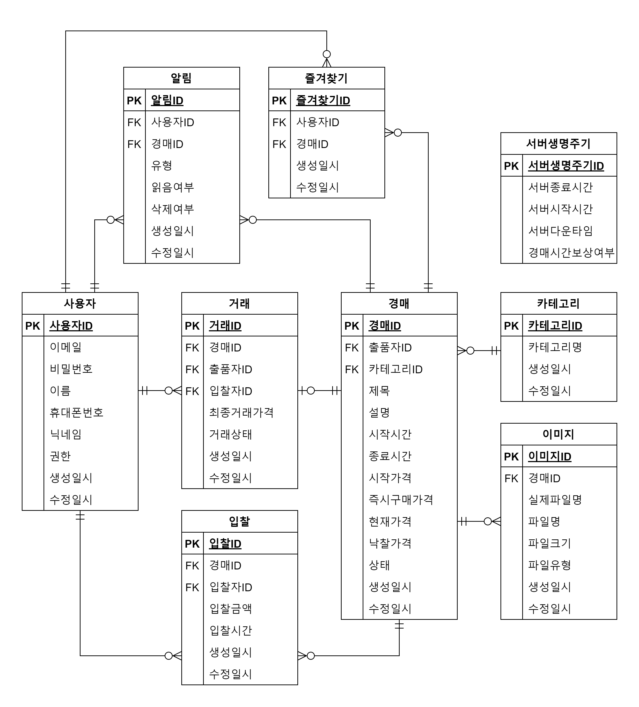
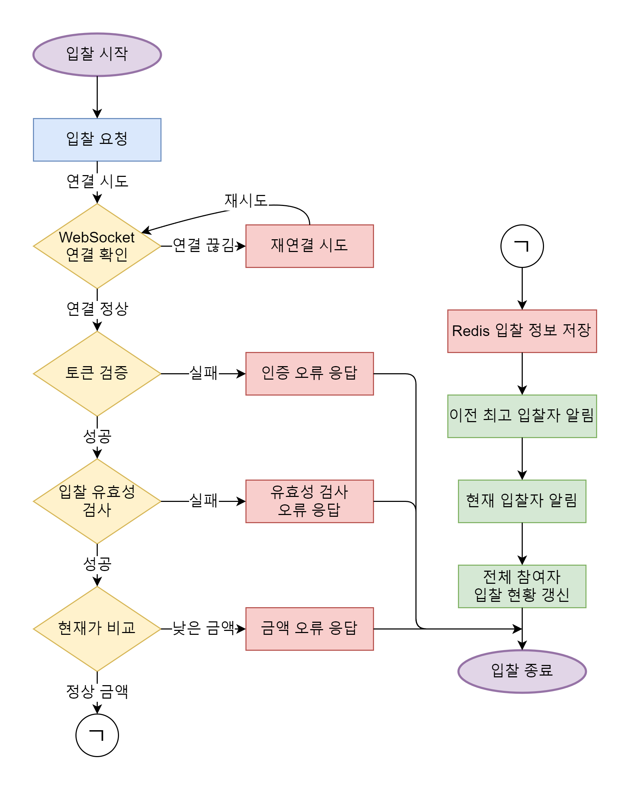
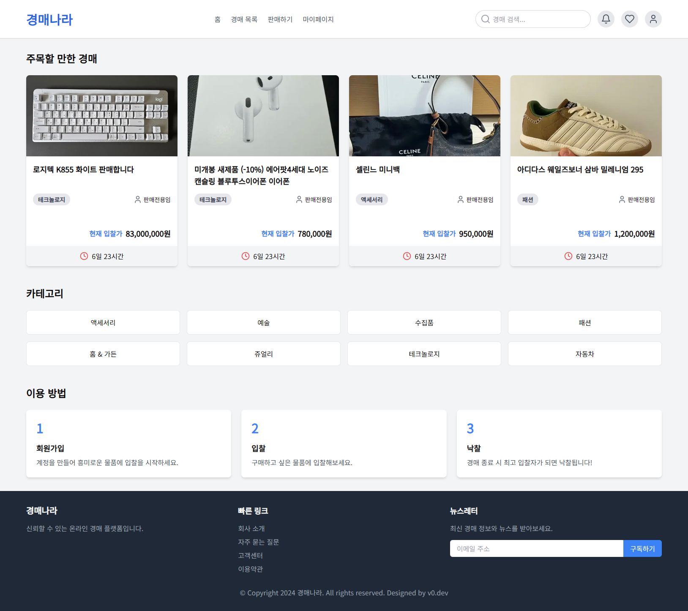
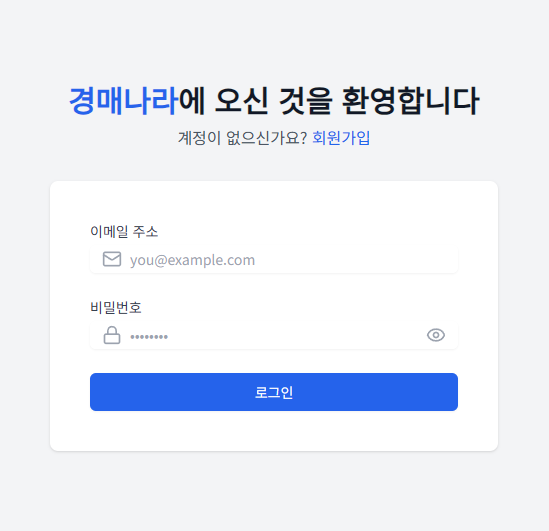
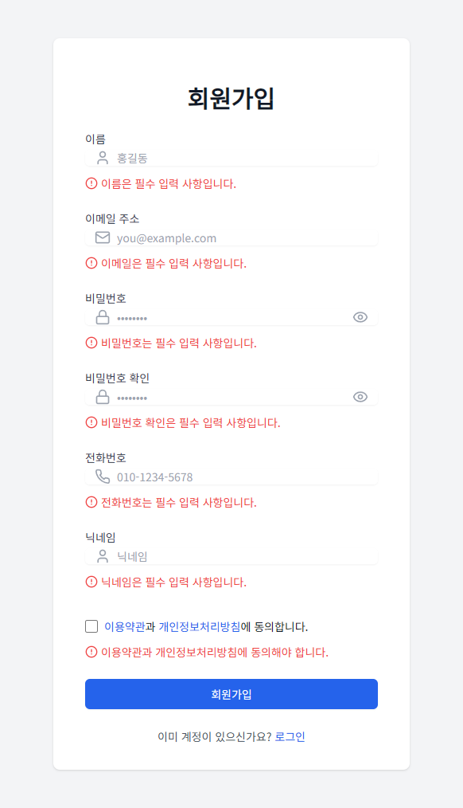
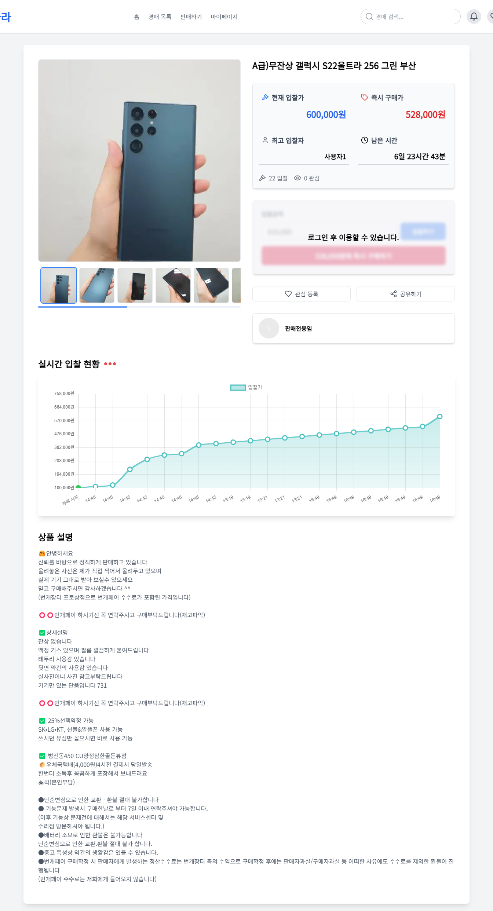
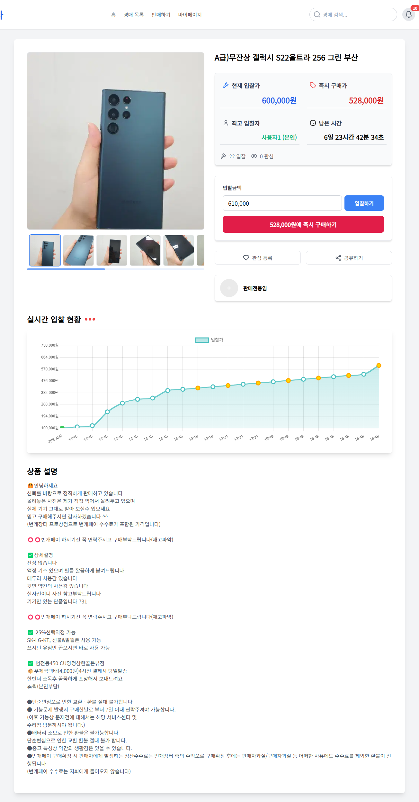
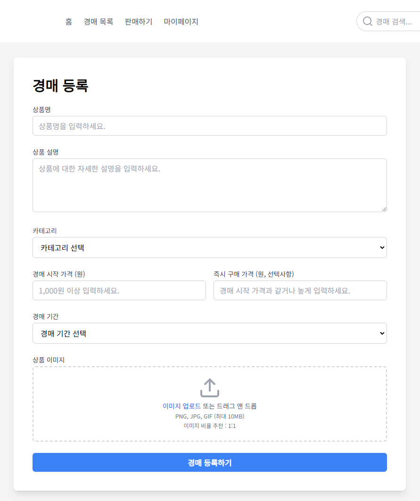
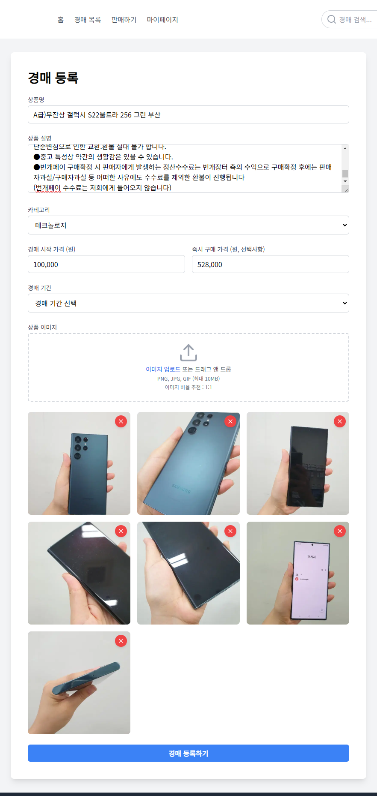
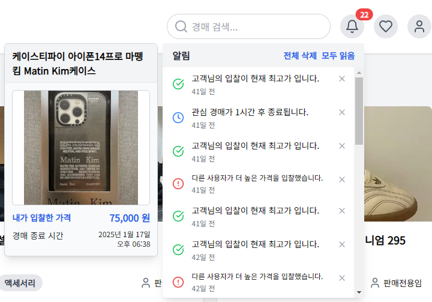

# 🔨 실시간 경매 시스템

## 📖 프로젝트 소개

실시간 입찰과 알림 기능을 제공하는 온라인 경매 플랫폼입니다. WebSocket을 활용한 실시간 입찰 시스템과 SSE를 통한 실시간 알림으로 사용자들에게 역동적인 경매 경험을 제공합니다.

## ⏰ 개발 기간

- 24.09.11일 - 24.12.11일

## ⚙ 개발 환경

### Frontend

- **Library**: `React 18.3.1`
- **State Management**: `Redux Toolkit 2.2.7`
- **Styling**: `TailwindCSS 3.4.12`
- **Chart**: `Chart.js 4.4.5`
- **HTTP Client**: `Axios 1.7.7`

### Backend

- **Language**: `Java 17`
- **Framework**: `Spring Boot 3.3.4`
- **Security**: `Spring Security`
- **ORM**: `Spring Data JPA`
- **Real-time Communication**: `WebSocket`, `SSE`
- **Cache**: `Redis 3.0.504`
- **Database**: `MariaDB 11.3`

## ⌨ E-R 다이어그램

<p align="center">
  
</p>

## 🔍 주요 기능

### 실시간 경매

- WebSocket을 활용한 실시간 입찰 시스템
- 입찰 현황 실시간 차트 시각화
- 자동 입찰 기능
- 즉시 구매 옵션
- 경매 시간 자동 연장 시스템
-

#### 실시간 경매 순서도

<p align="center">
  
</p>

### 실시간 알림

- SSE를 활용한 실시간 알림 시스템
- 입찰, 낙찰, 경매 종료 알림
- 새로운 경매 등록 알림
- 관심 상품 가격 변동 알림

### 사용자 기능

- JWT 기반 인증
- 관심 경매 등록

## 🖥 스크린샷

### 메인 페이지

<p align="center">
  
</p>

### 로그인

<p align="center">
  
</p>

### 회원가입

<p align="center">
  
</p>

### 경매 목록

<p align="center">
  
</p>

### 경매 상세

<p align="center">
  
</p>
<p align="center">
  
</p>

### 경매 등록

<p align="center">
  
</p>
<p align="center">
  
</p>

### 알림

<p align="center">
  
</p>

## 🔄 API 명세

### 인증 API

```
POST /api/auth/login     - 로그인
POST /api/auth/signup    - 회원가입
POST /api/auth/refresh   - 토큰 갱신
GET  /api/auth/logout    - 로그아웃
```

### 경매 API

```
GET    /api/auctions          - 경매 목록 조회
POST   /api/auctions          - 경매 등록
GET    /api/auctions/{id}     - 경매 상세 조회
POST   /api/auctions/{id}/bid - 입찰
```

### 알림 API

```
GET    /api/notifications          - 알림 목록 조회
PATCH  /api/notifications/{id}     - 알림 읽음 처리
DELETE /api/notifications/{id}     - 알림 삭제
```
