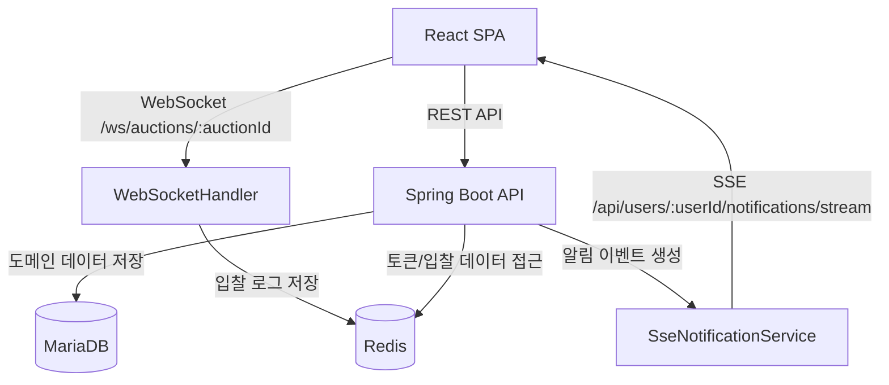
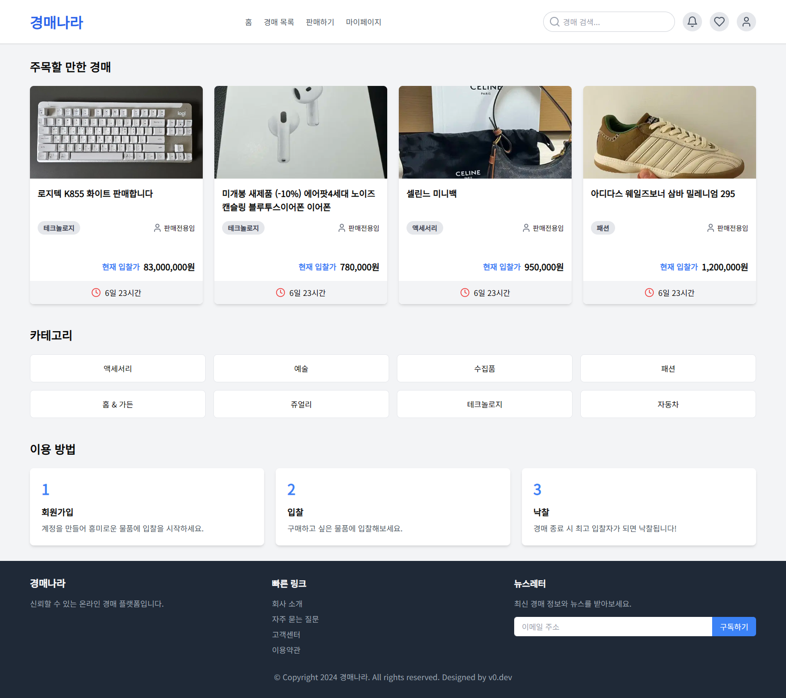
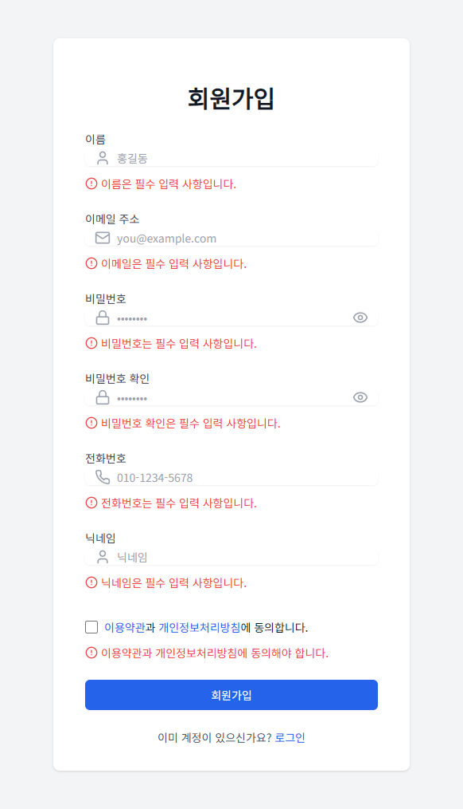
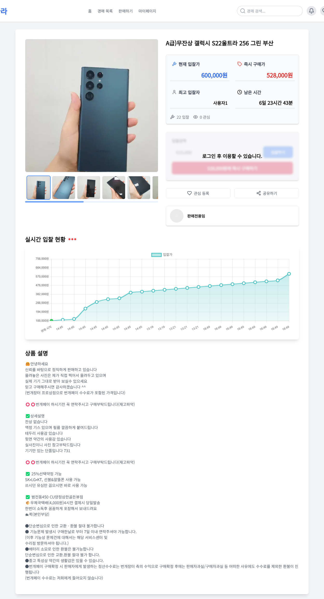
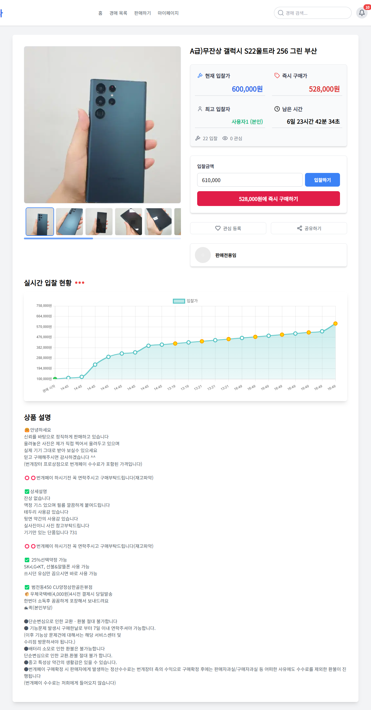
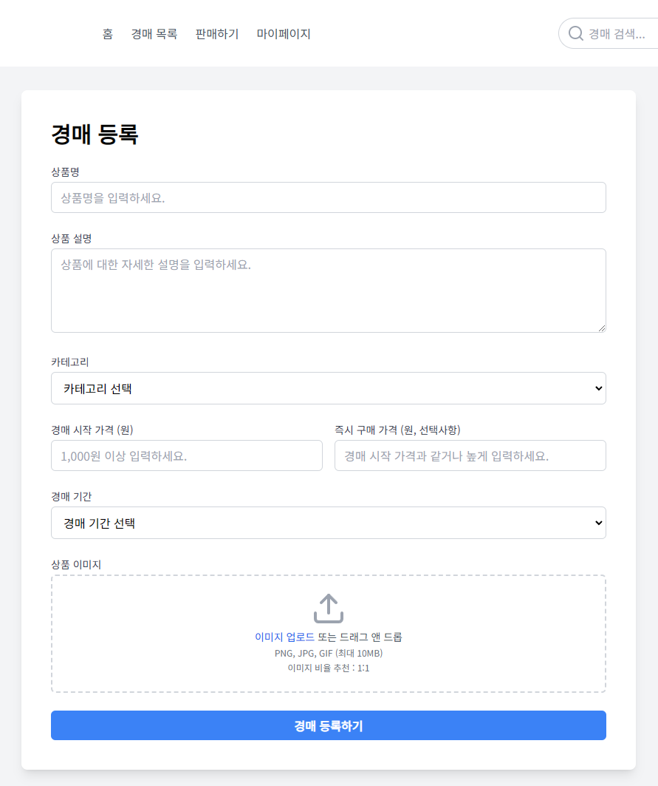
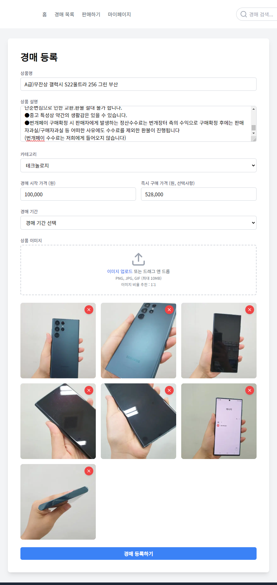
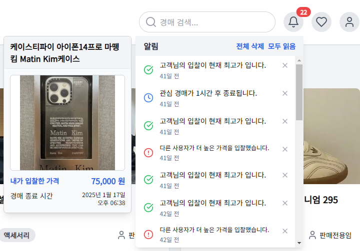
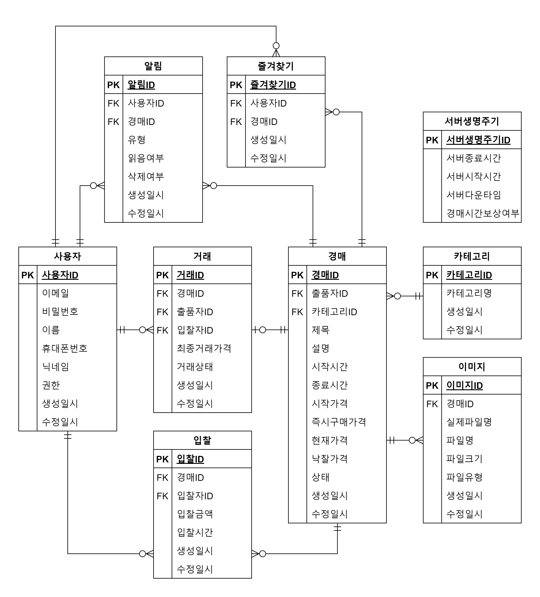
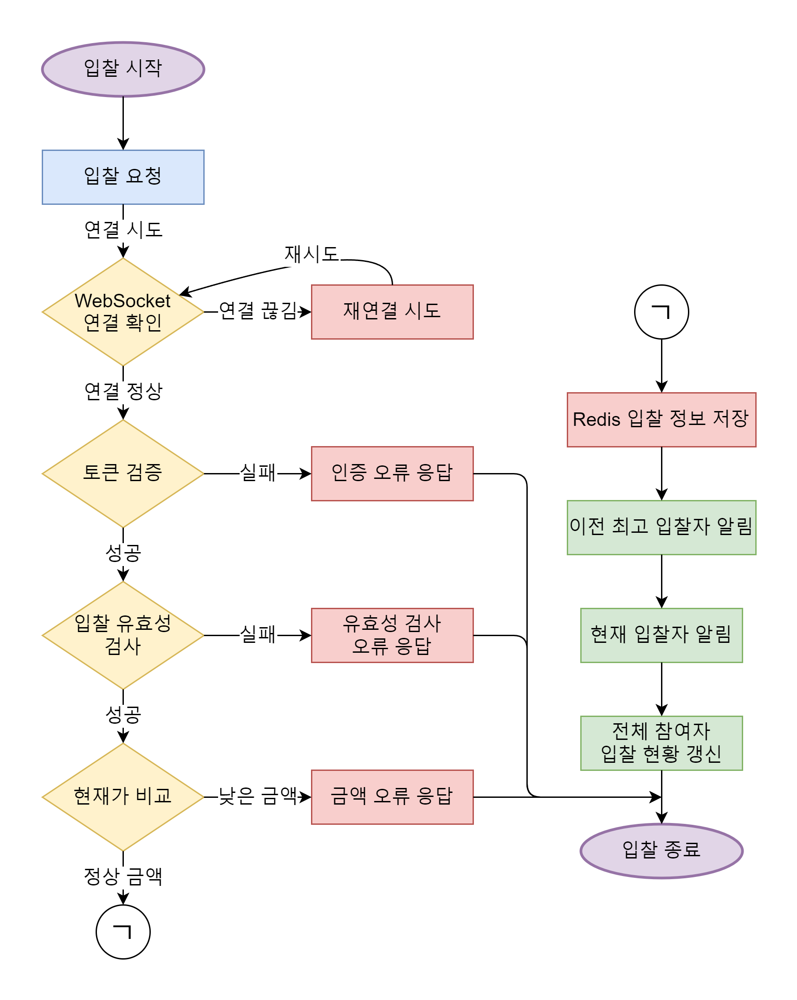

# 🔨 실시간 경매 시스템

## 📌 한 줄 소개

WebSocket 기반 실시간 입찰과 SSE 기반 사용자 알림을 결합한 온라인 경매 플랫폼입니다.

## 🧭 프로젝트 개요

- 개발 기간: `2024-09-11 ~ 2024-12-11`
- 문서 기준일: `2026-03-03`
- 코드 기준: 로컬 워크스페이스(`backend`, `frontend`, `monitoring`, `k6-test`, `server-health-check`)

## ⭐ 핵심 하이라이트

- 실시간 입찰: `ws://localhost:8080/ws/auctions/{auctionId}`
- 즉시구매 처리 분리: 요청은 HTTP(`POST /api/auctions/{id}/buy-now`), 결과 전파는 WebSocket(`buy-now`)
- 사용자 알림: SSE 스트림 `GET /api/users/{userId}/notifications/stream`
- 하이브리드 저장: MariaDB(정합성), Redis(실시간 입찰 로그/토큰)
- 종료 자동화: 스케줄러 기반 종료 정산 + 알림 전송

## 🏗 아키텍처 요약


```mermaid
graph TD;
    FE[React SPA];
    BE[Spring Boot API];
    WS[WebSocketHandler];
    SSE[SseNotificationService];
    DB[(MariaDB)];
    REDIS[(Redis)];

    FE -->|REST API| BE;
    FE -->|WebSocket /ws/auctions/:auctionId| WS;
    SSE -->|SSE /api/users/:userId/notifications/stream| FE;

    WS -->|입찰 로그 저장| REDIS;
    BE -->|도메인 데이터 저장| DB;
    BE -->|토큰/입찰 데이터 접근| REDIS;
    BE -->|알림 이벤트 생성| SSE;
```

## 🔍 핵심 기능

### 1. 실시간 입찰

- WebSocket 엔드포인트: `ws://localhost:8080/ws/auctions/{auctionId}`
- 메시지 타입:
  - 수신: `bid` (`buy-now` 요청은 HTTP API로 처리)
  - 송신: `bid`, `buy-now`, `ended`, `time`, `error`, `token_expired`
- 입찰 검증:
  - 판매자 본인 입찰 금지
  - 시작가/현재가 초과 조건 검증
  - 현재 최고입찰자 재입찰 금지

### 2. 실시간 알림

- 사용자별 SSE 엔드포인트: `GET /api/users/{userId}/notifications/stream`
- 이벤트 타입:
  - `connect` (초기 알림 스냅샷)
  - `notification` (신규 알림)
  - `ping` (keepalive)
- 알림 타입:
  - `BID`, `OUTBID`, `WIN`, `REMINDER`, `ENDED`, `ENDED_TIME`, `BUY_NOW_WIN`

### 3. 경매 종료 처리

- 스케줄러(`AuctionService.updateEndedAuctions`)가 30초 주기로 종료 경매 정산
- 즉시구매 종료 시:
  - 구매자: `BUY_NOW_WIN`
  - 기존 입찰자: `ENDED`
- 시간 만료 종료 시:
  - 최고입찰자: `WIN`
  - 비낙찰자: `ENDED_TIME`
- WebSocket `ended` 브로드캐스트 전송

### 4. 인증/인가

- 로그인 시 Access/Refresh JWT 발급
- Refresh Token은 Redis(`Auth`)에 TTL과 함께 저장
- 프론트 Axios interceptor로 `401 -> /api/auth/refresh` 재시도

## ⏱ 스케줄러/백그라운드 작업 요약

| 작업                    | 주기        | 동작                                                             |
| ----------------------- | ----------- | ---------------------------------------------------------------- |
| 종료 경매 정산          | 30초        | ACTIVE 경매 종료 처리, 낙찰/거래/알림 생성, `ended` 브로드캐스트 |
| 종료 임박 알림          | 60초        | 관심 등록 사용자에게 `REMINDER` 알림 전송                        |
| 알림 SSE ping           | 30초        | SSE keepalive                                                    |
| WebSocket 잔여시간 송신 | 60초        | 경매방별 `time` 이벤트 송신                                      |
| 서버 시작/종료 훅       | 이벤트 기반 | 다운타임 보상 계산 및 수명주기 기록                              |

## ⚖ 기술 선택과 트레이드오프

| 항목          | 선택            | 이유                               |
| ------------- | --------------- | ---------------------------------- |
| 실시간 입찰   | WebSocket       | 저지연 양방향 통신                 |
| 즉시구매 명령 | HTTP            | 트랜잭션/검증/오류코드 명확성      |
| 사용자 알림   | SSE             | 단방향 푸시 단순성                 |
| 저장 전략     | MariaDB + Redis | 정합성 데이터와 실시간 데이터 분리 |

## 📡 핵심 API 계약 요약

| 기능             | Method | Path                                       | 인증   |
| ---------------- | ------ | ------------------------------------------ | ------ |
| 로그인           | `POST` | `/api/auth/login`                          | 불필요 |
| 회원가입         | `POST` | `/api/auth/signup`                         | 불필요 |
| 내 정보 조회     | `GET`  | `/api/users`                               | 필요   |
| 경매 목록        | `GET`  | `/api/auctions`                            | 불필요 |
| 경매 상세        | `GET`  | `/api/auctions/{auctionId}`                | 선택   |
| 경매 생성        | `POST` | `/api/auctions`                            | 필요   |
| 즉시구매         | `POST` | `/api/auctions/{auctionId}/buy-now`        | 필요   |
| 관심 토글        | `POST` | `/api/auctions/{auctionId}/favorites`      | 필요   |
| 알림 목록        | `GET`  | `/api/users/notifications`                 | 필요   |
| 알림 스트림(SSE) | `GET`  | `/api/users/{userId}/notifications/stream` | 필요   |

## ⚠ As-Is 한계와 개선 계획

1. 보안 정책

- `requestMatchers("/**").permitAll()`로 HTTP 인증 강제가 약함
- 개선: 공개/보호 API 분리 + 기본 `authenticated()` 적용

2. 동시성 제어

- 입찰 경로가 원자적 경쟁 제어(분산락/CAS/@Version)까지는 미적용
- 개선: 원자 업데이트 전략 도입 + 회귀 부하 테스트 추가

3. 운영 스크립트 불일치

- `k6-test`의 WebSocket/SSE 경로 일부가 실제 엔드포인트와 불일치
- 개선: 스크립트 경로 정합화

## 🚀 빠른 시작

### 1. 사전 준비

- JDK 17
- Node.js / npm
- MariaDB (`auction_db`)
- Redis (`localhost:6379`)

### 실행 환경값 요약 (As-Is)

| 항목                | 값                                            |
| ------------------- | --------------------------------------------- |
| Backend API         | `http://localhost:8080`                       |
| Frontend Dev Server | `http://localhost:80`                         |
| WebSocket           | `ws://localhost:8080/ws/auctions/{auctionId}` |
| DB URL              | `jdbc:mariadb://localhost:3306/auction_db`    |
| Redis               | `localhost:6379`                              |
| Actuator            | `/actuator/health`, `/actuator/prometheus`    |

### 2. Backend 실행

```bash
cd backend
./gradlew bootRun      # macOS/Linux
.\gradlew.bat bootRun  # Windows
```

- 기본 주소: `http://localhost:8080`

### 3. Frontend 실행

```bash
cd frontend
npm install
npm start
```

- 개발 서버: `http://localhost:80`

### 4. Monitoring 실행 (선택)

```bash
cd monitoring
docker compose -f monitoring-docker-compose.yml up -d
```

- Prometheus: `http://localhost:9090`
- Grafana: `http://localhost:5000`

### 5. Health Check 실행 (선택)

```bash
cd server-health-check
npm install
npm start
```

## 🗂 모노레포 구조

| 경로                  | 설명                                                 |
| --------------------- | ---------------------------------------------------- |
| `backend`             | Spring Boot API, WebSocket, SSE, JPA/Redis, 스케줄러 |
| `frontend`            | React SPA, Redux, Axios                              |
| `monitoring`          | Prometheus / Grafana 로컬 모니터링                   |
| `k6-test`             | 부하 테스트 스크립트                                 |
| `server-health-check` | 서버 상태 체크 및 보조 기록 유틸                     |
| `assets`              | ERD/플로우차트/스크린샷                              |
| `docs`                | 상세 명세/분석 문서                                  |

## 스크린샷

### 메인 페이지

<p align="center">
  
</p>

### 로그인

<p align="center">
  
</p>

### 회원가입

<p align="center">
  
</p>

### 경매 목록

<p align="center">
  
</p>

### 경매 상세

<p align="center">
  
  
</p>

### 경매 등록

<p align="center">
  
  
</p>

### 알림

<p align="center">
  
</p>

## 📎 참고

### E-R 다이어그램

<p align="center">
  
</p>

### 실시간 경매 순서도

<p align="center">
  
</p>
